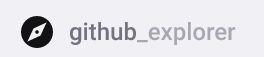

<h1 align="center">
 
  
 
 
Github Explorer
</h1>

Explore os repositórios Github

  

## Tecnologias Utilizadas
[//]: # (Add the features of your project here:)
Essa aplicação utiliza ferramentas e práticas atualizadas na criação de aplicações web.

- ⚛️ **React Js** — Uma biblioteca javascript para a construção de interfaces.

## Iniciando o Projeto
1. Clonar o repositório utilizando o comando git clone https://github.com/RosaAmanda/Github_Explorer.git
2. Navegar para a pasta Github_Explorer

## Iniciando o Front-End
1. Executar yarn para instalar as dependências
2. Executar yarn start para iniciar a aplicação frontend
